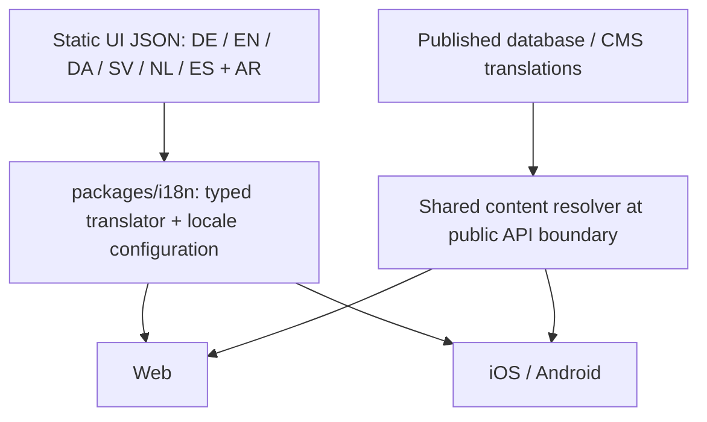

# Shared CITYWALK internationalization

Scope: shared Web/iOS/Android integration committed locally in `c23b0eb6e10321a2e8c5e89d1d5e9f737dde90bd`. No push, build, deployment or release acceptance accompanies this documentation checkpoint. Dated initial-validation results below are historical; current integration/device evidence lives in the QA ledger.

## Ownership



`@citywalk/i18n` contains **440 static string keys per locale** (checkpoint 2026-09-27). It has no React, Next.js, Expo, network or database dependency. It is a root npm workspace linked locally by Web, Mobile and traveler-core; both lockfiles record the local package. No external package versions were upgraded. Native retains its independent install and lockfile. The private traveler-core package references the sibling i18n public source entry points directly, so its linked source also resolves with only `mobile/node_modules` installed. An isolated temporary native install verified both shared packages without root dependencies.

- `src/locales/{de,en,da,sv,nl,es,ar}.json`: semantic navigation, Home, City Hub, Explore, place, planner, walk, Saved, Trips, Profile, assistant, loading, error, empty, common and taxonomy strings; additional legacy Web/account/checkout namespaces where their wording has distinct meaning.
- `src/locale-config.ts`: supported shared locales, English fallback, display/short labels, direction and language metadata. Native locale type and selector options derive from it.
- `src/types.ts`: typed dotted `TranslationKey` union derived from English JSON.
- `src/translator.ts`: lookup, interpolation, development diagnostics, category labels and cached immutable compatibility views.
- `src/adapters.ts`: **key mappings only**, retaining current screen APIs while removing their local string tables. Equivalent EN/DE/AR strings share the same semantic key; contextual differences keep distinct keys.
- `src/content.ts`: whole-record content fallback and development reporting of fallback public DTOs.
- `src/i18n.test.ts`: lookup, fallback, interpolation, safe runtime missing keys, locale/direction, all-key/placeholder consistency, adapter parity and dynamic content resolution.

## Static UI API

```ts
import { t, getLocaleDirection, isRTL, getLocaleLabel } from "@citywalk/i18n";

t("ar", "walk.add"); // أضف إلى جولتي
t("en", "planner.step", { step: 2 });
getLocaleDirection("ar"); // rtl
```

English is the UI fallback. A missing or empty localized string uses English. If even the English key is absent at runtime (for example an out-of-date caller), the key itself is returned without crashing. Typed callers cannot supply unknown keys. Development logs one warning per locale/key per translator; production does not warn. Missing interpolation values remain visible as placeholders. Replacement values are not recursively interpreted.

Brand text remains CITYWALK. Arabic navigation uses الرئيسية / استكشف / الجولات / المحفوظات / حسابي. Home and walk labels use the wording supplied in this request. Category names now use their shared localized label instead of an English taxonomy identifier where a label exists.

## Native migration

Existing consumers migrate through these compatibility adapters, with no route/storage/planner rewrite:

| Consumer | Shared source | Screens covered |
| --- | --- | --- |
| `mobile/src/lib/localization.ts` | `nativeCopy` semantic key map | Content, Place Detail, account/auth, tour/trip, audio, assistant and recovery |
| `mobile/src/design/discoveryCopy.ts` | `discoveryCopy` key map | Explore categories, City Hub, content loading, city assistant |
| `mobile/src/design/uxCopy.ts` | `uxCopy` key map | Walk membership and inline loading |
| `packages/traveler-core/src/walkCopy.ts` | `walkCopy` key map | Home, bottom navigation, City Hub, planner, route preview, active walk, Trips, Saved and finish |
| `mobile/src/lib/contentLabels.ts` | Shared category-label lookup | Taxonomy chips and planner categories |
| `LocaleSelector`, `rtlPresentation` | Shared locale labels/direction | Selector, text/source direction, alignment and rows |

The old traveler-core EN/DE/AR walk JSON and native EN/DE/AR UI objects are removed. Direction remains a presentation concern: content may be English fallback while the Arabic screen aligns right. Existing bidi isolation, unmirrored brand/photo/map imagery, directional Back/chevrons, safe areas and Slot style flattening remain intact. Tour cards read the actual UI locale; they no longer infer Arabic solely from RTL direction.

## Web integration and remaining locales

Web DE/EN/DA/SV/NL/ES/AR `getTranslations` and shared walk/account/checkout copy read the package. The seven migrated Web dictionaries are removed; `global-error` uses the shared English adapter. All **27 existing Web locales**, their priority order and routing validation remain available. The other **20** dictionaries stay under `src/translations`; existing French account/commerce/product copy also remains local. Those additional locales retain their previous fallback behavior for V2 walk copy.

Migration of an existing additional locale:

1. Add its complete static JSON to `packages/i18n/src/locales` using the English schema. Translate new native/V2 keys too; do not copy editorial city/place records into it.
2. Register metadata in `locale-config.ts` and the dictionary import in `translator.ts`. The locale union, Native selector and Web shared-source selection derive from these registrations; no screen changes are needed.
3. Run key/placeholder consistency and lookup tests, then native/Web locale and RTL tests. Keep honest fallback metadata for missing content.
4. Remove the now-unused legacy dictionary and explicit Web import/entry as cleanup once parity is verified. The Web accessor already prefers a registered shared locale over its legacy dictionary.
5. Review actual screens and localized content before treating that locale as accepted. Adding UI copy does not publish CMS translations or create approved audio.

The additional Web metadata remains in the compatibility module until its locales migrate; shared-locale metadata takes precedence. New shared locales join the existing Web locale list without changing its current priority order.

## Dynamic content and trust boundaries

`resolveLocalizedContent({ translations, canonical, identity }, locale)` selects:

1. A whole authored record in the requested locale.
2. An authored English record.
3. The explicit canonical/default record, if supplied.
4. `undefined` if nothing exists; it never invents an editorial translation.

It returns `requestedLocale`, `resolvedLocale`, `didFallback`, and `content`. The server's existing `resolvePublicLocalization` delegates to it and supplies the same canonical fallback order used before this migration. City, place, tour and city-index DTOs therefore retain their shape and identity. Native parses those resolved DTOs and reports their fallback metadata in development without relabeling the content as Arabic.

No CMS rows, IDs, slugs, publication state, media approval, RAG eligibility, API routes or audio-selection rules are changed. Audio remains exact-locale and does **not** use prose fallback.

Lübeck editorial fields previously embedded in Web UI dictionaries now live in `src/data/lubeckEditorial.json` as the **existing canonical/bootstrap content snapshot**. The canonical public source and explicit CMS bootstrap importer read that data directly rather than treating UI labels as authored editorial data. Authored editorial seed locales are enumerated from that data independently of UI support, so registering a UI locale cannot materialize English fallback as a translated tour. Nothing is imported into an application database by this task. Existing unpublished launch-card descriptions move alongside launch metadata in traveler-core's `launchContent.json`; product-specific marketing content is separated into `src/data/cityPassEditorial.json`. These are existing canonical content fallbacks, not new UI translations or substitutes for published CMS records.

## Remaining native literal audit

An AST scan of native TS/TSX literals plus a JSX-label/locale-branch search found:

| Remaining source | Why retained |
| --- | --- |
| `NativeChrome.tsx`: CITYWALK wordmark/accessibility label | Brand identity explicitly must not be translated |
| `displayNames.ts`: three city and 25 place Arabic transliterations | Existing compatibility fallback for incomplete published CMS names; authored Arabic still wins. Not static UI copy and deliberately excluded from the shared UI catalog. Remove this shim after CMS name coverage is published and device-verified |
| `contentLabels.ts`: three Arabic city-name replacements inside mixed Arabic editorial text | Existing display-only compatibility correction. Not a translated UI sentence or a change to CMS identity |
| `account/index.tsx`: `CITYWALK traveler` | Existing account-name fallback value in the auth payload, not a screen label; retained to avoid changing account behavior |
| `mediaAttribution.ts`: Wikimedia Commons / Creative Commons | Attribution/provider proper names |
| API/contracts, auth error matching, storage/routing/configuration | Parser diagnostics, error classification, protocol/schema values, routes and internal identifiers; not shown as untranslated screen UI |
| Metric/time notation, punctuation, checks and rating numerals | Format/visual symbols; the planner's `HH:MM` placeholder now has a shared key |
| Assets and photography | Brand artwork and editorial image pixels, not a text dictionary |

No remaining native EN/DE/AR UI translation object or conditional-language copy table was found. The name-transliteration shims are explicitly **not** a claim that those records have Arabic CMS translations.

## Known published Arabic gaps

The dated read-only Preview/production audit is [recorded here](../qa/citywalk-native-visual-parity/arabic-physical-polish.md). It found **5 Arabic places / 25**; **20** places have no published Arabic localization. Lübeck city content falls back to English; `historic-center-walk` has Arabic prose with a Latin city-name fragment. All twenty missing place slugs are listed in that report. This code migration neither changes nor fills those records. Shared static-copy completeness does not mean editorial Arabic coverage is complete.

## Acceptance scope

| Platform | Required | Current evidence |
| --- | --- | --- |
| Web compatibility | Required for changed consumers | Seven shared adapters; all 27 locale routes retained; current gates in the QA ledger |
| iOS | Primary traveler surface | Owner-confirmed scenarios in the QA ledger; unanswered locale/layout checks remain unverified |
| Android | Yes | Same shared consumers and automated bridge tests; device language/layout review pending |

Device follow-up: switch EN → DE → AR through the header; verify Home, City Hub, Detail, planner/progress/preview/active walk, membership, Saved, Profile and Ask. Check right alignment and Back direction, and that fallback prose remains visibly in its real language. Recheck previously accepted navigation/audio identity and Slot-crash paths. No new physical acceptance or screenshots are claimed.

## Initial architecture validation — before launch-language expansion

- Complete Web/shared suite: `npm run test:run -- --maxWorkers=2` — **845 passed / 139 files**; the **22 DB tests / 5 files** are opt-in and validated separately. The same 845 tests also passed in an earlier default-worker run.
- Complete native suite: `npm run test:run -- --maxWorkers=2` in `mobile/` — **290 passed / 43 files**, **29.07 seconds**, no unhandled errors.
- DB integration: **22 passed / 5 files**, **22.73 seconds**, in a new isolated loopback database after committed migrations; that temporary database was removed afterward.
- Final focused follow-up after the standalone-install adjustment: **69 passed / 6 files** (shared i18n, traveler-core, Web locale bridge, public content repository and city-pass copy).
- Shared package tests cover EN/DE/AR lookup, English fallback, missing/empty keys, development diagnostics, interpolation, direction, complete key/placeholder parity, authored Arabic content and honest fallback metadata.
- Web, mobile and standalone i18n TypeScript passed. Web and mobile lint passed with zero warnings.
- Standalone native dependency smoke check passed using fresh copies of the two shared packages and only a temporary `mobile/node_modules` installation; no Web dependencies were available to resolve their imports.
- `db:generate`: no schema changes or migration output. Local `db:verify`: 2 cities / 44 places (Lübeck 25, Hamburg 19). No existing application database content imports or CMS writes.
- Diff audit: no staged files, environment/signing/generated-build candidates or secret-pattern candidates; `git diff --check` passes. Earlier uncommitted native changes are retained.

Concurrent validation on this Mac produced five mobile five-second timeouts and one DB five-second timeout; a concurrent Web repeat was interrupted after timeouts. Suites were then run separately with lower worker concurrency. Test assertions and timeout thresholds were not changed. Existing Vite configuration migration advisories are unrelated to translation correctness.

Production builds, native builds/exports, Expo uploads, store submissions, commits and pushes were deliberately not run, as requested. Automated native bridge tests do not establish iOS/Android visual acceptance.

## Official launch-language expansion

Official launch locales are DE / EN / DA / SV / NL / ES; Arabic remains supported experimentally in native and retains Web support/RTL. `launch-locales.json` is the central launch gate. Native shows the six full language labels in one scrollable selector; development additionally offers Arabic. The standalone `i18n:check` script runs in both CI jobs and rejects missing/empty keys or mismatched placeholders. The initial expansion had 432 keys; the validated Commit 1 checkpoint has 440 keys in all seven catalogs.

See [current coverage, review behavior, layout risks and exact validation](../qa/citywalk-native-visual-parity/launch-languages.md) for the latest pass. Published CMS coverage and UI readiness are separate gates.

## Reconciled acceptance — 2026-09-25

See [the historical #137/#130 reconciliation](../qa/citywalk-native-visual-parity/launch-reconciliation.md) for the earlier investigation and content boundaries; current validation is in the reviewed checkpoint. Native preference now persists using existing AsyncStorage and resolves device language variants safely; the walk stays mounted through a locale content refresh. Key count follows English dynamically. #136 requires iOS/Android native capability parity and separate Public Web/Admin scope, not universal replication of each traveler feature across three frontends. The seven shared Web locale adapters and twenty legacy dictionaries retain existing Web functionality.
